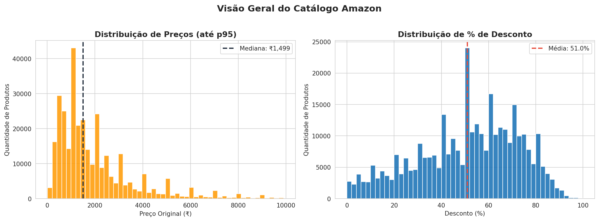
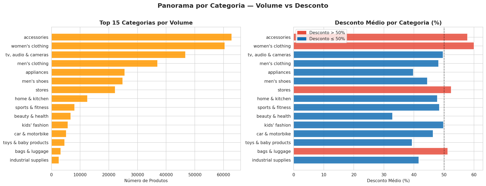
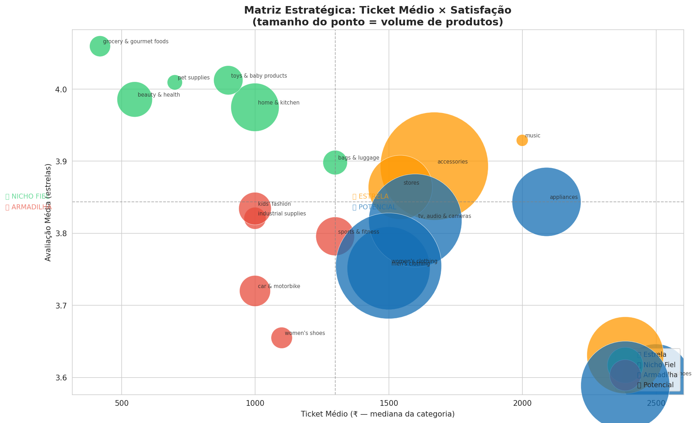
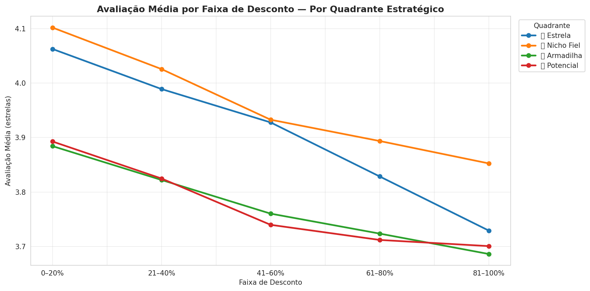

# Amazon Pricing Analysis: Desconto como Alavanca ou Armadilha?

## Contexto

Descontos são uma das estratégias mais usadas para impulsionar vendas.
Mas nem sempre mais desconto significa mais valor.

Esse projeto explora como diferentes níveis de desconto se relacionam
com a percepção do cliente, usando avaliações (ratings) como proxy.

## Problema

Descontos aumentam conversão no curto prazo, mas podem:

- reduzir margem
- atrair clientes menos qualificados
- impactar negativamente a percepção de valor do produto

A pergunta é simples: até que ponto o desconto ajuda — e quando começa a prejudicar?

## Hipótese

Descontos muito altos (acima de 70%) podem estar associados a pior avaliação média dos produtos.

## 📈 Visualizações

## Análise

A análise considera:

- distribuição de descontos no catálogo (551k produtos, 142 categorias)
- relação entre faixa de desconto e avaliação média
- segmentação estratégica por perfil de categoria

Os dados foram organizados em faixas de desconto para observar padrões de comportamento.

## Insight Principal

Existe uma tendência clara: quanto maior o desconto, pior a avaliação média do produto.

Produtos com descontos extremos (acima de ~70%) apresentam, de forma consistente,
avaliações mais baixas.

## Business Decision

Desconto nem sempre é alavanca.

Se o ganho incremental não compensar a perda de margem e o impacto na percepção
do cliente, ele passa a ser destruição de valor.

Na prática, isso sugere:

- evitar descontos extremos como estratégia padrão
- testar elasticidade de preço por categoria
- priorizar margem em vez de volume em determinados cenários

## Limitações

Essa análise é um ponto de partida. Em um cenário real, seria necessário validar:

- margem por produto
- quanto das vendas é realmente incremental
- impacto no comportamento do cliente ao longo do tempo (retenção, dependência de desconto)

## Próximos Passos

- rodar testes A/B para medir impacto real de desconto
- segmentar por categoria e tipo de produto
- incorporar métricas financeiras (margem, CAC, LTV)

## Estrutura do Projeto

| Arquivo | Descrição |
|---|---|
| `amazon_pricing_analysis.ipynb` | Análise exploratória completa |
| `fig1` a `fig8` | Gráficos e visualizações |

Nem todo crescimento é ganho real.

Em alguns casos, parar de dar desconto pode ser a melhor decisão de negócio.

## Desenho do Experimento

Para validar se descontos altos realmente destroem valor, eu rodaria um experimento controlado:

- **Grupo teste:** produtos com desconto alto (>70%)
- **Grupo controle:** produtos similares com desconto moderado

### Métricas:
- Taxa de conversão  
- Receita por cliente  
- Avaliação média  
- Impacto em margem  

### Objetivo:
Medir o impacto incremental real do desconto, separando correlação de causalidade.

## Tomada de Decisão

Se descontos altos aumentam conversão, mas reduzem margem e percepção do cliente, 
eles devem ser usados de forma estratégica — não como padrão.

## 🔗 Links

[📝 Artigo completo no Substack](https://marielleromani.substack.com/p/desconto-como-alavanca-ou-armadilha)  
[📦 Dataset no Kaggle](https://www.kaggle.com/datasets/lokeshparab/amazon-products-dataset)

---

*Análise desenvolvida por Marielle Romani | Python · Pandas · Matplotlib · Seaborn*
